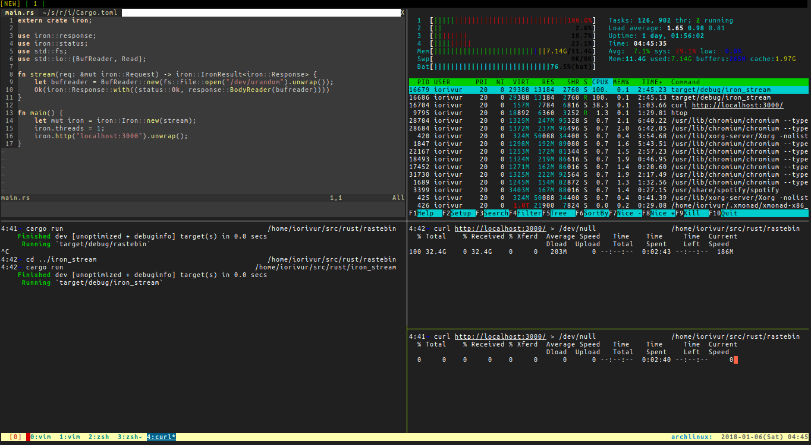

# Streaming test for iron

This sample is trying to return an infinite size file.
By limiting `iron.threads` as 1, the example could emphasize the current problem of iron which uses fixed number of threads. By default, the number is `8 * cpus` that is ocationally able to be led to exhaust of handling threads, like in this case.

The pic below is a screenshot of an experiment that runs this server and parallelly requests to it.

The `curl` command is stucking because the thread for request handling is occupied by request which can be seen above window.

